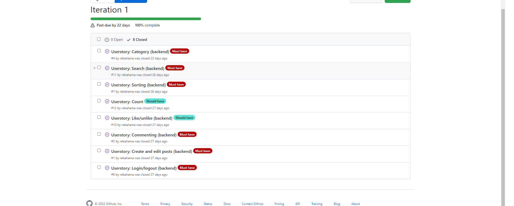
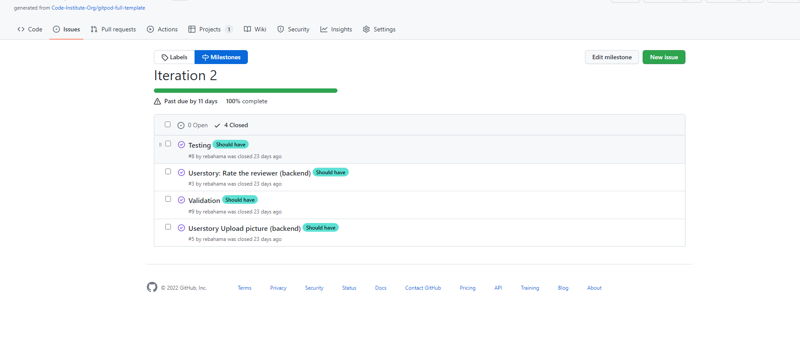

# Agile
## Overview

I had 12 userstories for the backend. And decided to have 2 iterations sprints after making the calculation for the story points and team velocity. Each sprint lasted around 8 days and the plan was that sprint one had 7 userstories and sprint 2 had 5 userstories.

# Userstories

## Must have

* As a siteuser I would like the site to categorise the reviews in diffrent subjects so that it's easy to find.

* As a user I would like to be able to sort the reviews based on popularity and price.

* As a user I can comment on a review post and also delete my own comment.

* As a user I can create,edit and delete reviews.

* As a user I would like to be able to search after a specfic review that is avalible throughout the site.

* As a site user I would like to be able to have an own account.

## Should have
* As a user I would like to be able to like a review if I find it appealing.

* As a site user I would like the reviews to display how many likes and comments the review have so I know how popular the review is.

* As a site user I would like to upload a picture together with my review post.

* As a siteuser, I want to be able to review from 0 to 5 about the other user that has created the review.

# Sprint 1
The must have userstories was prioritized in the first sprint, I wanted to finish all the userstories for must have before starting to work on the should have. As you can see all the must have stories was started and only 2 should have was in iteration 1. After 10 days I was done with most of the must have  userstories so I decided to include some  userstories from the product backlog  in iteration 1 because I hade some time to spare.

After 10 days the user stories below was completed:

# Sprint 2
Because I finished the most important userstories in sprint number 1, I had only 4 userstories left in this sprint. All of the userstories was should have. This sprint lasted around 8 days.

# Conclusion
All the userstories was completed before the time was due on the sprints, I added more userstories to the first sprint because I hade time to spare. And could start working on the userstories for the frontend. This time I also added testing and code validation to the userstories because in the last project I underestimated how long it would take to complete the testing and validation of code.

Click here to go back to the first [README](https://github.com/rebahama/social-reviewer-backend/blob/main/README.md)