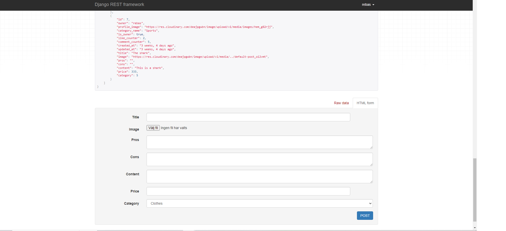

# Socialreviewer backend
The backend for socialreviewer was build using Django and Django rest framework.

# Website link
* [Deployed website](https://social-reviewer-backend.herokuapp.com/)

# User stories

* As a site user I would like the reviews to display how many likes and comments the review have so I know how popular the review is.

* As a user I would like to be able to search after a specfic review that is avalible throughout the site.

* As a user I would like to be able to like a review if I find it appealing.

* As a user I would like to be able to sort the reviews based on popularity and price.

* As a site user I would like to be able to have an own account.

* As a site user I would like to upload a picture together with my review post.

* As a siteuser I would like the site to categorise the reviews in diffrent subjects so that it's easy to find.

* As a siteuser, I want to be able to review from 0 to 5 about the other user that has created the review.

* As a user I can comment on a review post and also delete my own comment.

* As a user I can create,edit and delete reviews.

# Database diagrams

The database is used together with the Django framework, the software is called: PostgresSql and it is a relational database. There is 6 diffrent models and all wil be displayed below:

## Category

## Comments

## Likes

## Post

## Profile grades

## Profile

# Features

## Create review
User can create a review with the fields below and the post will be displayed

## Detailed post
User can fetch a post by id number and if the user is a owner the user will be able to edit and delete that post

# Category
Only admin can create a category, the categories have been created by admin.

# Comments
Comments can be created on the posts, if the current user is the owner of the comment, then it is possible to delete the comment.

# Likes
Likes can be added to a post only if the user have an account, only one like per post is allowed on every post.

# Profiles
When a user creates an account then it will be displayed here in the profile list, if the id of that profile is inputed in the url and if the current user is the owner of the profile then it will be possible to edit the information displayed.

# Profile grades
This is the same as the like but the user will be able to like a profile on the list.

# Filters
This is where the user will be able to serach after a reveiw with the keywords of: title, username and category. The user will also be able to sort the data depending on the information choosen from the picture below. User will also be able to only display the posts created by a particular profile choosen in the field with the help of the filter setting.

# Technology

* Django 3.2 was used for the backend.

* Cloudinary was used as a host to store the pictures.

* Pillow was used for image proccess.

* Django rest framework was used for serializing the data.

* Django filter was used to filter posts based on certain conditions.

* Django rest auth was used for authentication.

* Django allauth was used for user registration.

* Django rest framework simplejwt was used for the account tokens.

* Heroku was used for deployment.

* Github was used for develompment.

# Libraries and deployment

## Libraries
Before deploying the project the following packages need to be installed:

1. pip3 install  "django<4" 

2. pip3 install cloudinary-storage

3. pip3 install Pillow

4. pip3 install djangorestframework

5. pip3 install dj-rest-auth

6. pip3 install django-filter 

7. pip3 install "dj-rest-auth[with_social]"

8. pip3 install djangorestframework-simplejwt

9. pip3 install django-allauth

10. pip3 install dj_database_url==0.5.0 psycopg2

11. pip3 install gunicorn

12. pip3 install django-cors-headers

13. pip3 freeze > requirements.txt

14. Create a Procfile in the main directory of the project and inside add the following line:
release: python manage.py makemigrations && python manage.py migrate
web: gunicorn social_drf.wsgi

# Deployment

1. Go to Heroku and create a new app.

2. After creating a new app, go to "resources" and type " Heroky postgres" and add it.

3. Go to settings and scroll down to "config vars" and a DATABASE_URL will be created for the database.

4. Create a config var named CLOUDINARY_URL and paste in the api key from Cloudinary.

5. Create a config var named SECRET_KEY and paste in a password.

6. Add DISABLE_COLLECTSTATIC and set it to 1.

7. Connect your Heroku with Github and finally click deploy.

# Access enviorment variables

To access enviorment variable  type in the settings.py:

1. SECRET_KEY = os.environ.get['SECRET_KEY']

2. CLOUDINARY_URL = os.environ['CLOUDINARY_URL']

3. DEV_CHECK = os.environ['DEV_CHECK']

4. import dj_database_url and os at the top.

# Develop in local enviorment

1. Create a python file called env.py and import os

2. Add : os.environ["DATABASE_URL"] = value from heroku

3. Add os.environ["SECRET_KEY"] = value from heroku

4. Add os.environ["DEV_CHECK"] = '1'

5. Type python3 manage.py runserver to start up the browser.

# Connect your API to a frontend project

1. Go to Heroku and select your deployed REST API backend project.

2. Go to setting and select Reveal config vars.

3. Add: CLIENT_ORGIN = your deployed frontend projects url.

4. Add: CLIENT_ORGIN_DEV = your frontend gitpod preview link.

5. Dont forget to remove the trailing slash at the end of the url links.

6. Every couple of weeks, Gitpod will update the preview url. As a result, you will need to reconnect your Heroku DRF API Project to your Gitpod preview URL

# Agile
File for agile approach can be found here: [Agile](https://github.com/rebahama/social-reviewer-backend/blob/main/AGILE.md).

# Testing
Testing the API can be found here: [Testing](https://github.com/rebahama/social-reviewer-backend/blob/main/TESTING.MD).

# Credits

* Inspiration and help to get started was taken from the Code institute DRF walkthrough video.

* The official Django rest framework website was used [DRF](https://www.django-rest-framework.org/)

