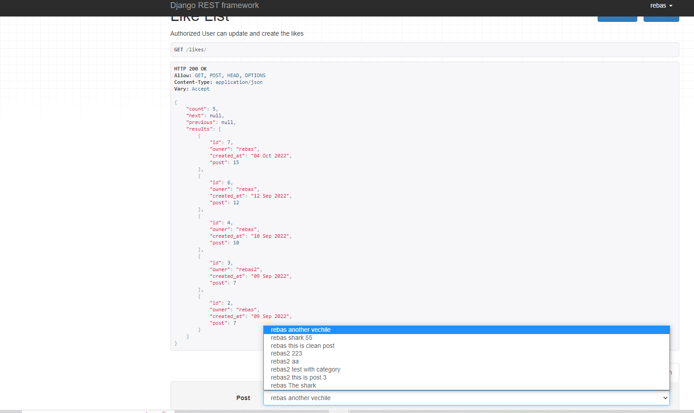
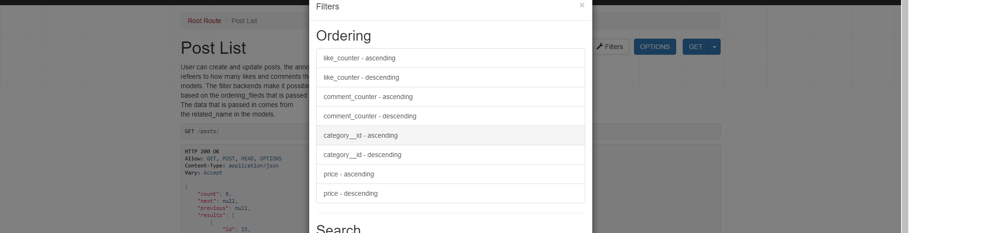
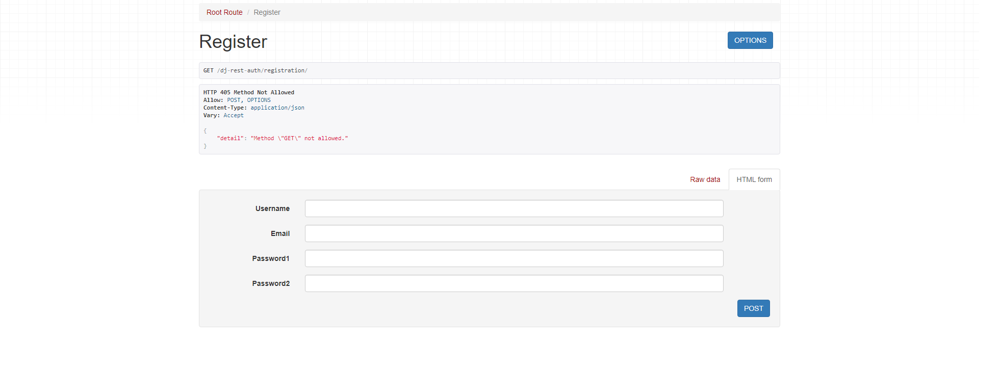
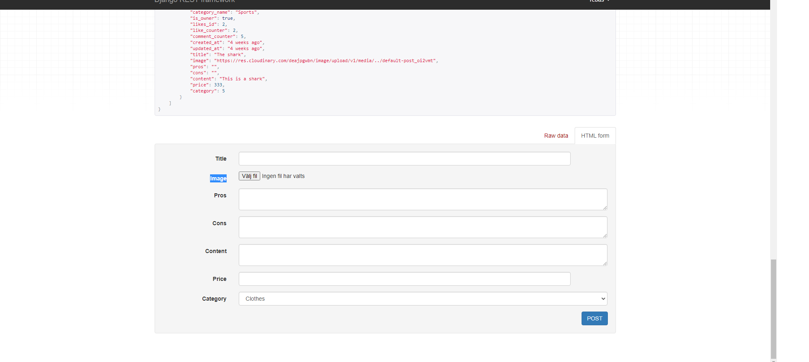
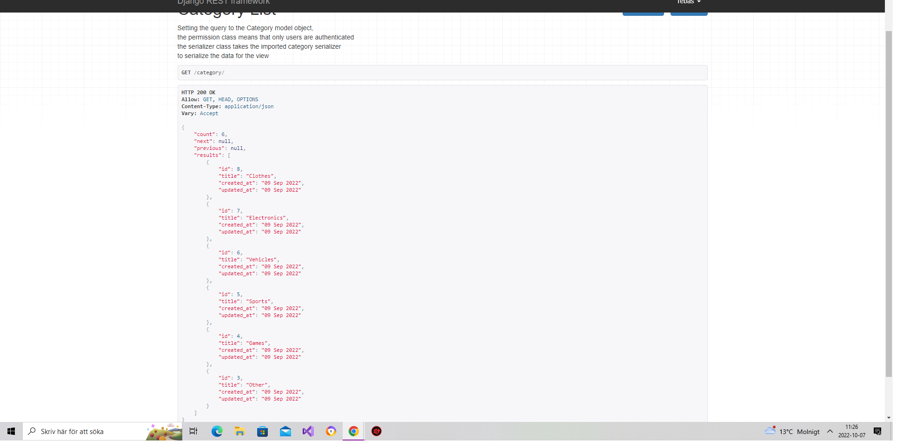
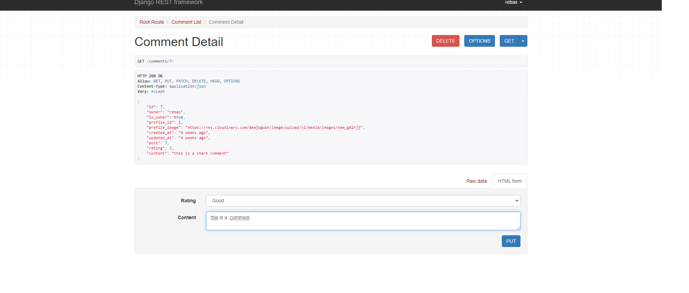
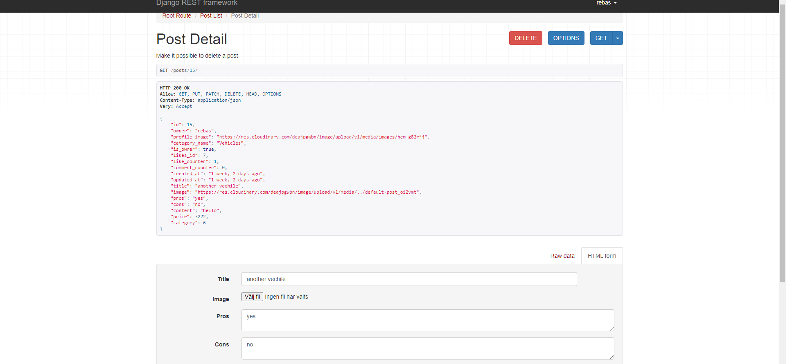

# Manual Testing
## Testing the user stories on the API.

* As a site user I would like the reviews to display how many likes and comments the review have so I know how popular the review is.

Like and comment counter is displayed in the API.

* As a user I would like to be able to search after a specfic review that is avalible throughout the site.

Users can search in the api after, title,name and category.

* As a user I would like to be able to like a review if I find it appealing.

Users can like a post

* As a user I would like to be able to sort the reviews based on popularity and price.

Users can sort the reviews based on the choosen parameter below in the picture.

* As a site user I would like to be able to have an own account.

Users can register account.

* As a site user I would like to upload a picture together with my review post.

Users can upload images

* As a siteuser I would like the site to categorise the reviews in diffrent subjects so that it's easy to find.

Users can choose from the categories below to add to the review before uploading it to the API.

* As a siteuser, I want to be able to review from 0 to 5 about the other user that has created the review.

Users can choose from comments and rate the review.

* As a user I can comment on a review post and also delete my own comment.

Comments can be created and deleted.

* As a user I can create,edit and delete reviews.

Users can delete,edit review.

# Testing API

## Posts
The posts can be created,edited and deleted. The posts can only be deleted/edited if the user is a owner of the content.

## Comments
Comments can be left on a post, only registered users can left comments on a post. Comments can only be deleted/edited if the user is owner of the comment.

## Likes
Like comments the likes can be left on a post, only registered users can like a post. A user can´t like a post twice, and the like can be deleted by the user that created the like from the beginning.

## Account
Accounts can be created with the help of a username and a password of choice.

## Search
The search function can find posts based on following parameters, username, title and category of the posts.

## Ordering
The ordering have been tested and you can order by the comments, and the likes, either from highest to lowest or vice versa.

## Error
If the id does not exist of a particular post or comment or like then a message is shown and displaying "not found".

## Filters
The filter have been tested so that the API can display only the posts of a particular profile and also the posts with a particular category.

## Authentication
If a user tries to edit or delete another posts that have been created by another user then the fields will disappear and not making it possible to do this action unless you are the owner of the post. The same princibal is implemented in comments and likes.

## Display
All the comments, posts and profiles can be displayed and shown in the API.

# Bugs
* When I tried to display the relevant comments to the relevant posts the comments would not show up. I had installed the Django filter and used it in the views.py file. Later when I installed it I could finally see the relevant comments to the posts.

* In the admin page of the live deployed version the css files are not loading, I choose to not focus on that problem for now as it is an API json response.

# Validation of files

1. All the py files have been validated with this tool [pep8 validator](http://pep8online.com/). Only error "line too long" is found is on line 164, I tried to make it shorter but the Django progam would stop working so I let it be.

Click here to go back to the first [README](https://github.com/rebahama/social-reviewer-backend/blob/main/README.md)